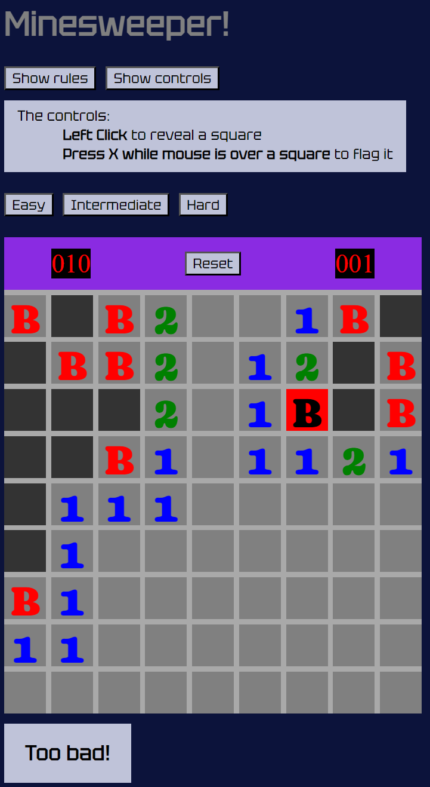

# Minesweeper!

## Overview
Welcome to Minesweeper! This game is my version of the classic puzzle game where you try to reveal all squares that don't have bombs in them. This version of the game allows the user to change between three different boards of varying difficulties. The user can also flag the location they believe bombs are on.

## Getting Started
[**Link to Site**](https://agloo055.github.io/Minesweeper-Project-1/)

[**Credit for Event Listener**](https://stackoverflow.com/questions/70840870/trigger-click-on-keypress-on-hovered-element)

## Screenshots

### Wireframe

## Technologies Used
    -HTML
    -CSS
    -Javascript

## Next Steps
    -Make a online leaderboard
    -Add a customized board option
    -Clean up the css
